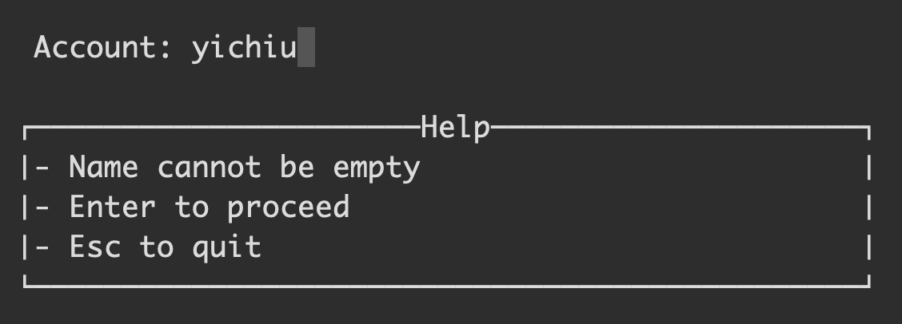

# HasKeychain
The general goal of our project is to design an application that is capable of managing users’ passwords and generating as well as deleting passwords for users.

# Architecture
## Environment
- Language: Haskell
- Package:
  - base >=4.9 
  - random >=1.1 && <1.2,
  - containers
  - parsec
  - mtl
  - aeson
  - bytestring
  - cryptohash
  - split
  - crypto-cipher-types
  - vty
  - brick
  - directory
  - transformers
  - cursor
  - cursor-brick
  - lens
  - text
  - tuple
  - terminal-size
  - strict
## Data
```Haskell
data PassData = PassData { 
    _name      :: T.Text, 
    _account   :: T.Text,
    _password  :: T.Text
}
```
## State
```Haskell
data TuiState = TuiState {  
    _tuiStatePaths :: !(NonEmptyCursor PassData), 
    _stateCursor :: !TextFieldCursor, 
    _eventState :: !Int -- 0 browse 1 watch 2 search 3 insert, 
    _focusItem :: !(Maybe PassData), 
    _inputString :: String, 
    _typingName :: T.Text, 
    _typingAccount :: T.Text, 
    _windowH :: !Int
} 
```
## Functionality
- Browsing passwords
- Searching passwords
- Creating passwords
- Deleting passwords

# Demo
## Starting Window

## Browsing Password

## Searching Password


## Generating Password



